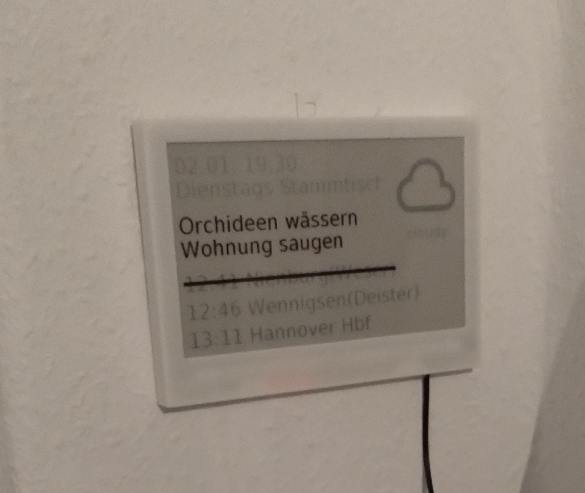

# Zugverspätungsanzeige

Ich wollte neben meiner Haustür eine Anzeige haben, die mich über aktuelle
Zugverspätungen informiert.

In Home-Assistant kann man die Abfahrt der nächsten drei Züge integrieren
mit dem folgenden snippet:

```yaml
rest:
 -  resource: https://www.bahnhof.de/api/boards/departures?evaNumbers=8000152&filterTransports=REGIONAL_TRAIN&filterTransports=CITY_TRAIN&stationCategory=5&locale=de
    scan_interval: 300
    sensor:
      - name: "Nächster Zug"
        value_template: "{{ value_json[0][0]['timeSchedule'] | as_timestamp |timestamp_custom('%H:%M') }} {{ value_json[0][0]['destination']['name'] }}"
        unique_id: "nachster_zug"
      - name: "Nächster Zug Extras"
        value_template: "{{ value_json[0][0]['timeDelayed'] | as_timestamp |timestamp_custom('%H:%M') }} {{ value_json[0][0]['messages']['cancelation'][0]['text'] }}"
        unique_id: "nachster_zug_extra"
      - name: "Übernächster Zug"
        value_template: "{{ value_json[1][0]['timeSchedule'] | as_timestamp |timestamp_custom('%H:%M') }} {{ value_json[1][0]['destination']['name'] }}"
        unique_id: "ubernachster_zug"
      - name: "Übernächster Zug Extras"
        value_template: "{{ value_json[1][0]['timeDelayed'] | as_timestamp |timestamp_custom('%H:%M') }} {{ value_json[1][0]['messages']['cancelation'][0]['text'] }}"
        unique_id: "ubernachster_zug_extra"
      - name: "Drittnächster Zug"
        value_template: "{{ value_json[2][0]['timeSchedule'] | as_timestamp |timestamp_custom('%H:%M') }} {{ value_json[2][0]['destination']['name'] }}"
        unique_id: "drittnachster_zug"
      - name: "Drittnächster Zug Extras"
        value_template: "{{ value_json[2][0]['timeDelayed'] | as_timestamp |timestamp_custom('%H:%M') }} {{ value_json[2][0]['messages']['cancelation'][0]['text'] }}"
        unique_id: "drittnachster_zug_extra"

```

Am besten einmal auf https://bahnhof.de gehen, den eigenen Bahnhof, die
gewünschten Zugtypen angeben und sich dann freuen.

Der Zug und das extra wurde hier bewusst getrennt um dann in esphome das eine
in schwarz und das andere in rot anzeigen zu können ohne zu große Berechnungen
machen zu müssen.


Ich habe dann noch meinen nächsten Termin, das Wetter und eine TODO-Liste
integriert.

Resultat:



Nach einigen Wochen Laufzeit muss ich leider sagen, dass zumindest das
schwarz echt schlecht zu sehen ist. Es geht manchmal besser, manchmal
schlechter, aber im allgemeinen doch noch erkennbar.
