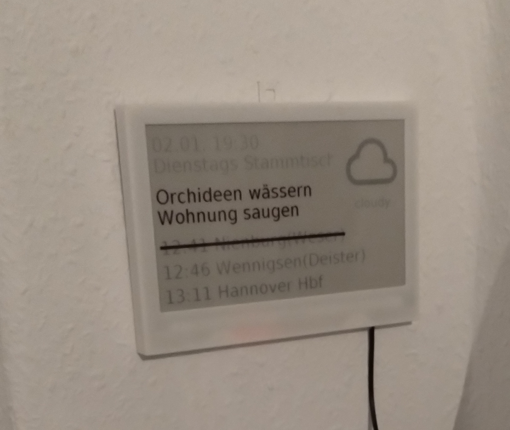

# Zugverspätungsanzeige

Ich wollte neben meiner Haustür eine Anzeige haben, die mich über aktuelle
Zugverspätungen informiert.

Anfangs habe ich die Daten dazu direkt von der API hinter bahnhof.de abgeholt
und mittels der REST-schnittstelle in home-assistant rein gehackt.
Mitlerweile habe ich dazu einen home-assistant integration geschrieben, weil
die API sich ständig ändert und es irgendwie nervig war mit den REST-Sachen umzugehen.

Die Integration fragt nach dem Bahnhof, ist aber noch nicht sonderlich intelligent,
sondern nimmt den erstbesten, der gefunden wird.

Das ganze ist sehr instabil, aber läuft heute ganz gut.

Zum installieren den Order bahnabfahrtzeiten in den home-assistant
$config/custom_components/ Ordner kopieren. Auf keinen Fall umbennennen und Home-Assistant
starten, dann kann man über die UI einen Bahnhof hinzufügen und bekommt die
nächsten X abfahrten angezeigt.

Ich habe dann noch meinen nächsten Termin, das Wetter und eine TODO-Liste
integriert.

Resultat:

Nach einigen Wochen Laufzeit muss ich leider sagen, dass zumindest das
schwarz echt schlecht zu sehen ist. Es geht manchmal besser, manchmal
schlechter, aber im allgemeinen doch noch erkennbar.
